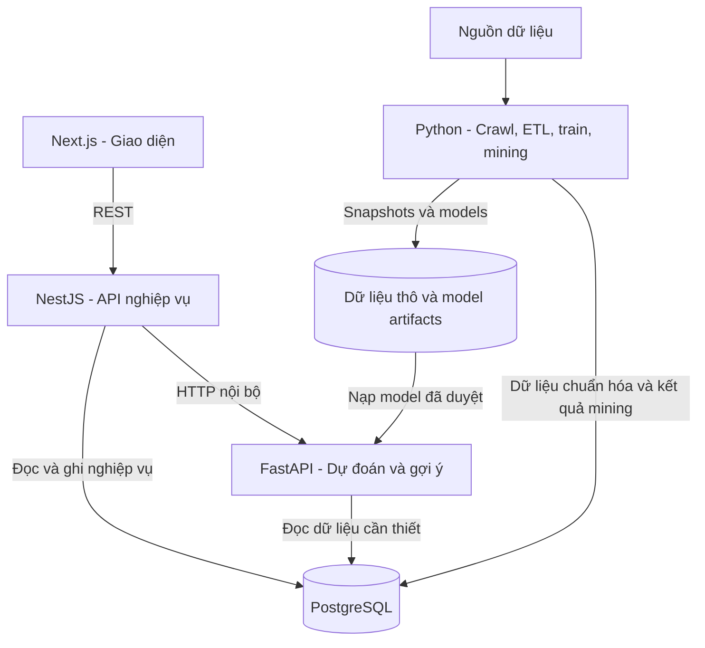

---
categories:
  - "[[Reference Guides]]"
subjects:
  - "[[System Design]]"
  - "[[Data Science & ML]]"
type: deep-dive
status: seedling
created: 2026-09-22
---

# Liqi Architecture

## Context & Goals

Liqi cần hỗ trợ ba nhóm tính năng: dự đoán kết quả trận đấu, khai phá luật kết hợp và gợi ý cấm/chọn. Dữ liệu trận đấu và cấu trúc crawling chưa hoàn chỉnh, vì vậy kiến trúc phải cho phép mở rộng dữ liệu và thay đổi thuật toán mà ít ảnh hưởng đến web app.

Kiến trúc đề xuất:

- **Next.js:** giao diện người dùng.
- **NestJS:** API nghiệp vụ, triển khai dạng modular monolith.
- **FastAPI và Python worker:** inference, crawling, ETL, mining và training.
- **PostgreSQL:** cơ sở dữ liệu chung.
- **Object storage hoặc persistent volume:** dữ liệu thô, snapshots và model artifacts.

## Architecture Diagram



## Components

| Thành phần        | Trách nhiệm                                                                                                                                                                                            |
| ----------------- | ------------------------------------------------------------------------------------------------------------------------------------------------------------------------------------------------------ |
| **Next.js**       | Dashboard, danh sách tướng, lịch sử trận đấu, màn hình draft, biểu đồ và kết quả phân tích. Dùng Server Components cho trang đọc dữ liệu; Client Components cho pick/ban, bộ lọc và biểu đồ tương tác. |
| **NestJS**        | API công khai, validation, tài khoản nếu cần, phiên draft, thống kê và điều phối request sang FastAPI.                                                                                                 |
| **FastAPI**       | API nội bộ để chạy model dự đoán và xếp hạng gợi ý tướng.                                                                                                                                              |
| **Python worker** | Crawl, chuẩn hóa dữ liệu, tạo features, FP-Growth, training và đánh giá model.                                                                                                                         |
| **PostgreSQL**    | Dữ liệu chuẩn hóa, dữ liệu ứng dụng, thống kê và kết quả mining.                                                                                                                                       |
| **Kho tệp**       | Phản hồi gốc, HTML/JSON, dataset snapshots, model và metadata model.                                                                                                                                   |

### NestJS Modules

- `CatalogModule`: tướng, vai trò, trang bị và phiên bản game.
- `MatchesModule`: giải đấu, đội, tuyển thủ, series và từng game.
- `AnalyticsModule`: pick rate, ban rate, win rate, combo và luật kết hợp.
- `DraftModule`: trạng thái ban/pick, validation lượt hợp lệ và lưu draft.
- `PredictionModule`: chuẩn bị request, gọi FastAPI và trả kết quả.
- `DataJobsModule`: theo dõi crawl, xử lý dữ liệu và training.
- `AuthModule`: tài khoản và quyền admin khi cần.

## Features & Data Flow

| Tính năng | Xử lý nền bằng Python | Khi người dùng sử dụng |
| --- | --- | --- |
| **Match prediction** | Tạo features, train, đánh giá và lưu model. | NestJS gọi FastAPI để lấy xác suất thắng. |
| **Association rules** | Chạy FP-Growth theo dataset/patch; lưu support, confidence và lift. | NestJS truy vấn kết quả đã tính trong PostgreSQL. |
| **Draft recommender** | Tính synergy, counter statistics hoặc train model xếp hạng. | FastAPI chấm điểm các tướng còn hợp lệ theo draft state. |

Luật kết hợp được tính trước, không chạy lại FP-Growth cho mỗi request. Baseline của draft recommender nên xếp hạng theo vai trò còn thiếu, synergy với đồng đội, counter với đối phương, độ lớn và độ mới của dữ liệu, cùng ràng buộc pick/ban. GNN chỉ nên là bước nâng cấp sau khi có baseline và đủ dữ liệu.

### Request Flow

1. Next.js gửi trạng thái draft hoặc input dự đoán đến NestJS.
2. NestJS kiểm tra input và các ràng buộc nghiệp vụ.
3. NestJS gọi endpoint nội bộ của FastAPI.
4. FastAPI chạy model hoặc thuật toán xếp hạng đã được nạp.
5. NestJS trả kết quả cho giao diện.

Điểm xếp hạng gợi ý phải được phân biệt với xác suất thắng. Kết quả ML cần kèm `model_version`, `dataset_version` và patch áp dụng.

## Data Design

Chia dữ liệu thành ba lớp để parser có thể thay đổi mà vẫn truy vết và xử lý lại:

| Lớp | Nội dung | Mục đích |
| --- | --- | --- |
| **Raw** | Phản hồi gốc, URL nguồn và thời gian crawl. | Kiểm tra hoặc xử lý lại khi parser thay đổi. |
| **Normalized** | Tướng, đội, game, picks/bans và kết quả đã chuẩn hóa. | Nguồn thống nhất cho ứng dụng. |
| **Derived** | Features, thống kê, luật kết hợp và model artifacts. | Phục vụ phân tích và ML. |

### Suggested Tables

| Nhóm | Bảng |
| --- | --- |
| Danh mục | `heroes`, `hero_aliases`, `items`, `patches` |
| Thi đấu | `tournaments`, `teams`, `players`, `series`, `games` |
| Chi tiết game | `game_teams`, `game_player_stats`, `draft_actions` |
| Phân tích | `hero_patch_stats`, `association_rules`, `model_versions` |
| Vận hành | `crawl_runs`, `dataset_versions`, `data_jobs` |
| Ứng dụng | `users`, `draft_sessions`, `prediction_history` nếu cần |

Các quyết định dữ liệu quan trọng:

- Phân biệt `series` và `game`; BO5 có nhiều game, mỗi game có draft và kết quả riêng.
- Lưu thứ tự pick/ban để đánh giá gợi ý theo từng lượt.
- Dùng `hero_aliases` để chuẩn hóa tên và ID giữa các nguồn.
- Gắn patch khi xác định được vì sức mạnh tướng thay đổi theo phiên bản.
- Lưu provenance và khóa theo source/ID trận để chống nhập trùng.
- Giữ các game trong cùng series ở cùng một tập khi đánh giá để giảm leakage.

Với prediction sau draft, không đưa vàng, mạng hạ gục hoặc trang bị phát sinh sau draft vào features. Nếu dự đoán tại phút thứ 5, cần snapshot đúng thời điểm đó.

## API Endpoints

| NestJS endpoint | Cách xử lý |
| --- | --- |
| `GET /heroes` | Đọc PostgreSQL. |
| `GET /analytics/hero-combos` | Đọc kết quả mining đã lưu. |
| `POST /predictions/match` | Validate input và gọi FastAPI. |
| `POST /drafts/recommendations` | Validate draft state và gọi FastAPI. |
| `POST /admin/data-jobs` | Tạo tác vụ nền. |
| `GET /admin/data-jobs/:id` | Đọc trạng thái tác vụ. |

HTTP nội bộ giữa NestJS và FastAPI phù hợp cho MVP. NestJS cần đặt timeout và trả lỗi rõ ràng khi ML service tạm thời không khả dụng.

## Tech Stack & Deployment

Monorepo đề xuất:

```text
apps/web       # Next.js
apps/api       # NestJS
services/data  # FastAPI, crawler, ETL, mining, training
contracts      # API schemas và request/response examples
infra          # Docker Compose và cấu hình triển khai
```

Giai đoạn đầu dùng một PostgreSQL với quyền sở hữu schema rõ ràng:

- Schema `app`: NestJS quản lý user, draft session và request history.
- Schema `data`: Python quản lý dữ liệu chuẩn hóa, thống kê và mining results.
- NestJS chỉ đọc dữ liệu cần thiết trong `data`; FastAPI đọc dữ liệu/model cho inference.
- Nếu dùng Prisma và Alembic, mỗi schema phải có một bên quản lý migration; không để hai công cụ cùng thay đổi một bảng.

Python CLI có thể chạy theo lịch trong MVP. Khi cần kích hoạt từ trang admin, thêm Celery + Redis: FastAPI tạo job, worker xử lý và trả `job_id` để NestJS theo dõi.

## Trade-offs & MVP

| Quyết định | Lợi ích | Đánh đổi |
| --- | --- | --- |
| NestJS modular monolith | Dễ phát triển và deploy; module vẫn tách biệt. | Cần giữ ranh giới module để tránh monolith khó bảo trì. |
| FastAPI riêng | Python tự do dùng thư viện ML; thay model không ảnh hưởng web app. | Thêm service, timeout và vận hành HTTP nội bộ. |
| PostgreSQL dùng chung | Đơn giản hóa truy vấn và triển khai MVP. | Cần phân quyền, schema ownership và migration rõ ràng. |
| Tính mining offline | Request nhanh và kết quả ổn định. | Dữ liệu mới không phản ánh ngay nếu chưa chạy job. |
| Celery + Redis chỉ khi cần | Không làm MVP phức tạp sớm. | Ban đầu chưa có job orchestration từ web. |

MVP: **Next.js + NestJS + FastAPI + PostgreSQL**, Python jobs chạy riêng, dữ liệu thô và model lưu trên persistent volume, toàn bộ chạy bằng Docker Compose.

Thứ tự triển khai: **chuẩn hóa dữ liệu và dashboard → luật kết hợp → prediction baseline → draft recommender**. Mốc đầu tiên là bộ dữ liệu từng game có nguồn rõ ràng, kết quả, đội hình và draft đã chuẩn hóa.

## References

- [Next.js: Server and Client Components](https://nextjs.org/docs/app/getting-started/server-and-client-components)
- [NestJS: Modules](https://docs.nestjs.com/modules)
- [FastAPI: Background Tasks](https://fastapi.tiangolo.com/tutorial/background-tasks/)
- [[Liqi-crawling]]
- [[Liqi]]
